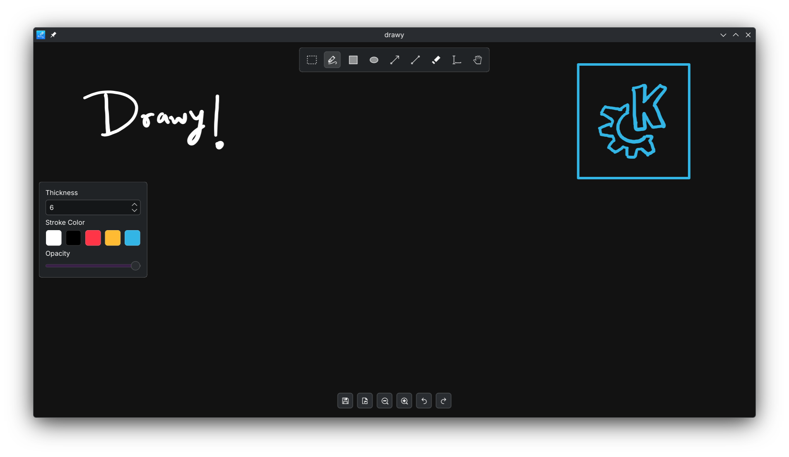

# Drawy
Your handy, infinite brainstorming tool!



Drawy is a lightweight infinite whiteboard built for simplicity and high performance. It includes core features expected from whiteboard tools, such as:
1. Pressure-sensitive drawing with tablet support
2. An infinite canvas
3. Support for images, text, and basic shapes including rectangles, ellipses, arrows, and lines
4. Exporting drawings as images
5. Customizable color palette
6. And many more!

### Discuss
If you wish to discuss anything regarding Drawy, you are welcome to join its Matrix room here: https://go.kde.org/matrix/#/#drawy:kde.org

### Compiling from Source
#### Using kde-builder
Drawy can be built using [`kde-builder`](https://develop.kde.org/docs/getting-started/building/kde-builder-compile/)
```
kde-builder drawy
```

#### Using cmake
If you have all dependencies installed, you can use cmake to build it:
```
git clone https://invent.kde.org/graphics/drawy && cd drawy
cmake --preset release
cmake --build build-release
./build-release/bin/drawy
```

#### Using ASAN
You may use the `sanitizers.supp` file.
For example: `LSAN_OPTIONS=suppressions=$PWD/sanitizers.supp drawy`

### Contributing
Contributions are welcome. Please read the [contributing guide](CONTRIBUTING.md) before opening merge requests.

### License
This project uses the GNU General Public License V3.
